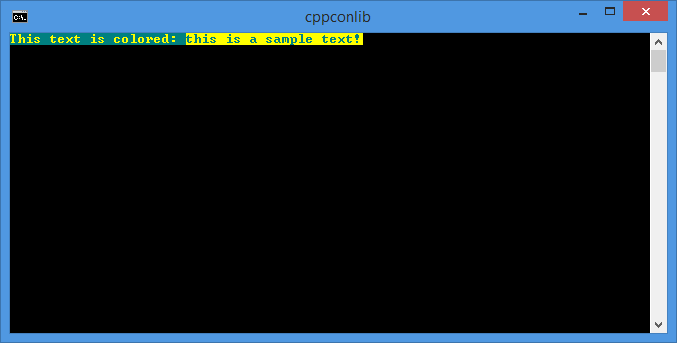
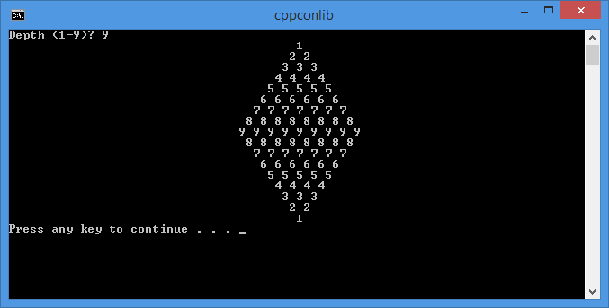

# cppconlib

A header-only C++ template library for manipulating the settings of a Windows console (colors, text position, input mode, etc.)

## Features

This library provides a set of helper classes, functions and constants in the header conmanip.h for manipulating a Windows console (using the Windows console functions). The library features the following components:

- `console_context<T>`: represents a context object for console operations; its main purpose is restoring console settings; typedefs for the three consoles are available (`console_in_context`, `console_out_context` and` console_err_context`)
- `console<T>`: represents a console objects providing operations such as changing the foreground and background colors, the input mode, screen buffer size, title, and others; typedefs for the three consoles are available (`console_in`, `console_out` and `console_err`)
- manipulating functions that can be used with `cout`/`wcout` and `cin`/`wcin`: `settextcolor()`/`restoretextcolor()`, `setbgcolor()`/`restorebgcolor()`, `setcolors()`, `setmode()`/`clearmode()`, `setposx()`/`setposy()`/`setpos()`.


## Requirements

The library is written with C++11 features and requires Visual Studio 2012 or newer.

## Examples

The following example prints some text in custom colors and then reads text in a different set of colors.

```cpp
#include "conmanip.h"
using namespace conmanip;

#include <iostream>

int main()
{
   // create a console context object, used for restoring console settings
   console_out_context ctxout;
   // create a console object
   console_out conout(ctxout);

   // change the title of the console
   conout.settitle("cppconlib");

   // output text with colors
   std::cout
      << settextcolor(console_text_colors::light_yellow)
      << setbgcolor(console_bg_colors::cyan)
      << "This text is colored: ";

   // read text with colors
   std::string text;
   std::cin
      >> settextcolor(console_text_colors::cyan)
      >> setbgcolor(console_bg_colors::light_yellow)
      >> text;

   std::cout << std::endl;

   // restore console attributes (text and background colors)
   ctxout.restore(console_cleanup_options::restore_attibutes);

   return 0;
} // -> console settings are restored here when the context object goes out of scope
```

Here is the output for this program.


The following code prints a rhomb to the console:

```cpp
int main()
{
   console_out_context ctxout;
   console_out conout(ctxout);

   conout.settitle("cppconlib");

   int depth;
   std::cout << "Depth (1-9)? ";
   std::cin >> depth;

   int middle = conout.getsize().X/2;
   for(int i = 1; i <= depth; ++i)
   {
      std::cout << setposx(middle-i+1);

      for(int j = 1; j<=i; ++j)
      {
         std::cout << i << " ";
      }
      std::cout << "\n";
   }

   for(int i = depth-1; i >=1; --i)
   {
      std::cout << setposx(middle-i+1);

      for(int j = 1; j<=i; ++j)
      {
         std::cout << i << " ";
      }
      std::cout << "\n";
   }

   return 0;
}
```


