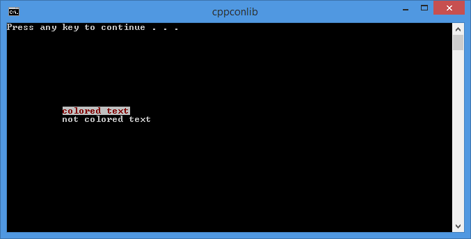

The library is available in header conmanip.h in the conmanip namespace. There are various types and functions available that are described below.

# Enumerations
The following enumerations are defined:
* `console_text_colors` defines the available colors for the text
* `console_bg_colors` defines the available colors for the background. The colors for text and background are actually the same, however they are represented by different underlying values as defined by the console APIs.
* `console_type` defines the available (standard) consoles: input, ouput and error
* `console_modes` defines a set of console modes (used by the [SetConsoleMode](http://msdn.microsoft.com/en-us/library/windows/desktop/ms686033(v=vs.85).aspx) function). You can use any combination of
  * `echo`: when set (which is the default) characters typed are visible in the console; when disabled, they are not; the disabled mode is useful when a user needs to enter a password for instance.
  * `overwrite`: when enabled a new character typed in the console overwrites the last character (is displayed in the same position)
  * `hide_ctrl_c`: when enabled, CTRL+C is processed by the system and is not placed in the input buffer
  * `enable_mouse_selection`: enables selection in the console with the mouse
* `console_cleanup_options`: defines the options for restoring the (modified) settings of a console. You can use any combination of:
  * `none`: nothing is restore
  * `restore_pos`: only the position of the text is restored
  * `restore_attibutes`: only the text attributes (colors) are restored
  * `restore_mode`: only the console mode is restored
  * `restore_buffsize`: only the buffer size is restored
  * `restore_all_nopos`: all settings except for the position are restored
  * `restore_all`: all settings are restored

## console_context class
This is a template class parameterized with the console type (input, output or error) and is used for storing contextual information about a console (handle, screen buffer info, clean-up options and mode). It also allows restoring the (modified) settings, based on the specified clean-up options.

```
template <console_type StdHandle>
class console_context
{
public:
  HANDLE                     handle;
  CONSOLE_SCREEN_BUFFER_INFO scrbuf_info;
  console_cleanup_options    cleanup;
  DWORD                      mode;

public:
  console_context(console_cleanup_options const cleanup = console_cleanup_options::restore_all_nopos);
  ~console_context();

  void restore();
  void restore(console_cleanup_options const options);
};
```
Several typedefs are available:
```
typedef console_context<console_type::in>       console_in_context;
typedef console_context<console_type::out>      console_out_context;
typedef console_context<console_type::err>      console_err_context;
```

### Examples
You can use a console_context to restore the settings of a console.
```
void test()
{
   console_out_context ctxout;
   
   // make changes to the console here
} // <- changes are restored as the context object goes out of scope
```
If you don't want to use the default cleanup options (which is restore_all_nopos) you can declare a context with specific restoring options. The following sample declares a context that doesn't restore anything:
```
console_out_context ctxout(console_cleanup_options::none);
```

## console class
This is a template class parameterized with the console type (input, output or error). The constructor can take a console_context. If none is specified a default one is used (that uses the restore_all_nopos cleanup options). The console class defines various operations with the console, such as changing the text and background colors, the text position, the console mode, the screen buffer or the console title.
```
template <console_type StdHandle>
class console 
{
  console_context<StdHandle> context;

public:
  console(console_context<StdHandle> const & context = console_context<StdHandle>());

  void setmode(console_modes const modes);
  void clearmode(console_modes const modes);
  int getposx();
  void setposx(int const x);
  int getposy();
  void setposy(int const y);
  COORD getpos();
  void setpos(int const x, int const y);
  void settextcolor(console_text_colors const & color);
  void setbgcolor(console_bg_colors const & color);
  void setcolors(console_text_colors const & text, console_bg_colors const & background);
  void resetcolors();
  COORD getsize();
  bool setsize(int const x, int const y);
  bool settitle(std::string const & title);
  bool settitle(std::wstring const & title);
  std::string gettitle();
  std::wstring gettitlew();
};
```
Several typedefs are available:
```
typedef console<console_type::in>               console_in;
typedef console<console_type::out>              console_out;
typedef console<console_type::err>              console_err;
```

### Examples
The following example changes the title of the output console, the text and background colors then sets the position of the text and prints a text. The colors are then restored to their defaults and another text is printed at another position. Then the context object goes out of scope all the default console settings are restored.
```
int main()
{
   console_out_context ctxout(console_cleanup_options::restore_all);
   console_out conout(ctxout);

   conout.settitle("cppconlib");
   conout.setbgcolor(console_bg_colors::white);
   conout.settextcolor(console_text_colors::red);

   conout.setpos(10, 10);
   std::cout << "colored text";

   conout.resetcolors();

   conout.setpos(10, 11);
   std::cout << "not colored text";

   return 0;
}
```


## Manipulator functions
The library also defines a set of free functions to be used in conjunction with `std::cout`/`std::wcout` and `std::cin`/`std::wcin`. These are the same functions available in the console class.
```
console_manipulator<console_text_colors> settextcolor(console_text_colors const color);

template <console_type StdHandle>
console_manipulator<console_text_colors> settextcolor(console_text_colors const color, console_context<StdHandle> const context);

template <console_type StdHandle>
console_manipulator<console_text_colors> restoretextcolor(console_context<StdHandle> const context);

console_manipulator<console_bg_colors> setbgcolor(console_bg_colors const color);

template <console_type StdHandle>
console_manipulator<console_bg_colors> setbgcolor(console_bg_colors const color, console_context<StdHandle> const context);

template <console_type StdHandle>
console_manipulator<console_text_colors> restorebgcolor(console_context<StdHandle> const context);

console_manipulator<console_colors> setcolors(console_text_colors const text, console_bg_colors const background);

template <console_type StdHandle>
console_manipulator<console_colors> setcolors(console_text_colors const text, console_bg_colors const background, console_context<StdHandle> const context);

console_manipulator<console_modes> setmode(console_modes const modes);

template <console_type StdHandle>
console_manipulator<console_modes> setmode(console_modes const modes, console_context<StdHandle> const context);

console_manipulator<console_modes> clearmode(console_modes const modes);

template <console_type StdHandle>
console_manipulator<console_modes> clearmode(console_modes const modes, console_context<StdHandle> const context);

console_manipulator<int> setposx(int const x);

template <console_type StdHandle>
console_manipulator<int> setposx(int const x, console_context<StdHandle> const context);

console_manipulator<int> setposy(int const y);

template <console_type StdHandle>
console_manipulator<int> setposy(int const y, console_context<StdHandle> const context);

console_manipulator<COORD> setpos(int const x, int const y);

template <console_type StdHandle>
console_manipulator<COORD> setpos(int const x, int const y, console_context<StdHandle> const context);
```
The console_manipulator is a helper class that ease the use of these functions with operator<< and operator>>.

### Examples

The previous example can be re-written like this:
```
int main()
{
   console_out_context ctxout(console_cleanup_options::restore_all);
   console_out conout(ctxout);

   conout.settitle(L"cppconlib");

   std::wcout 
      << setbgcolor(console_bg_colors::white) 
      << settextcolor(console_text_colors::red)
      << setpos(10, 10)
      << L"colored text";

   std::wcout 
      << restorebgcolor(ctxout) 
      << restoretextcolor(ctxout);

   std::wcout 
      << setpos(10,11)
      << L"not colored text";

   return 0;
}
```
